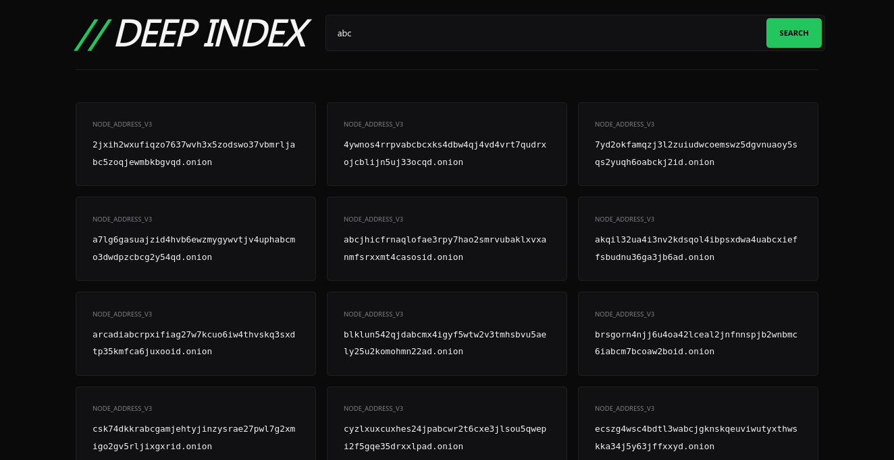

# Deep Index
A simple .onion link aggregator and high-performance search engine with a brutalist design.

<p align="center">
  
  
</p>

## Overview
**Deep Index** is a lightweight PHP-based search engine designed to crawl and cache hidden services from the Deep Web. It prioritizes speed, a brutalist "dark-mode" aesthetics, and zero-bloat functionality.

The engine synchronizes with the **[Ahmia.fi](https://ahmia.fi/onions/)** public database to provide a curated list of active Onion V3 nodes, storing them locally for instant access.

## Features
- **Automated Sync:** Intelligent caching system that refreshes the index periodically.
- **SQLite3 Backend:** Fast, file-based persistence (no heavy SQL setup required).
- **Onion V3 Ready:** Optimized regex filters for 56-character v3 addresses.
- **Minimalist UI:** A cold, terminal-inspired interface focused on logic and readability.

## Prerequisites
To run this project on your local machine or a server, you need:

* **PHP 8.1+**
* **PHP Extensions:** `php-sqlite3`, `php-curl`
* **Web Server:** Apache, Nginx, or the PHP built-in server.

## Installation

### macOS
```bash
# Install Homebrew (if not already installed)
/bin/bash -c "$(curl -fsSL https://raw.githubusercontent.com/Homebrew/install/HEAD/install.sh)"

# Install PHP and dependencies
brew install php curl
```

### Ubuntu/Debian
```bash
sudo apt install php-cli php-sqlite3 php-curl -y
```

### Fedora/Red Hat
```bash
sudo dnf install php php-sqlite php-curl -y
```

## Getting Started

1.  **Clone the repository:**

    ```bash
    git clone https://github.com/BryanApolonio/Deep-Index.git
    cd Deep-Index
    ```

2.  **Directory Initialization:**
    The data/ folder must exist and be writable for the SQLite database to be initialized. If the folder is missing, create it:

    ```bash
    mkdir -p data
    chmod 775 data
    ```

3.  **Run the server:**

    ```bash
    php -S localhost:8000
    ```

    Open `http://localhost:8000` in your browser.

## Project Structure

```text
├── assets/
│   ├── css/style.css       # Optimized Styles
│   └── img/                # UI Screenshots (home.png & results.png)
├── data/
│   └── deep_index.db       # SQLite Persistence (Auto-generated)
├── includes/
│   └── engine.php          # Crawler & Search Logic
├── index.php               # Entry Point (Home)
└── results.php             # Data Grid View (Search)
```

## Credits & Data Source

This project functions as a gateway to the distributed web. We acknowledge and credit **[Ahmia.fi](https://ahmia.fi/)** for their invaluable contribution to the privacy ecosystem.

**Deep Index** uses the [Ahmia.fi/onions](https://ahmia.fi/onions/) as its primary data feed to maintain an updated directory of hidden services.

**Disclaimer:** This tool is for educational and research purposes only. Use it responsibly and at your own risk.
